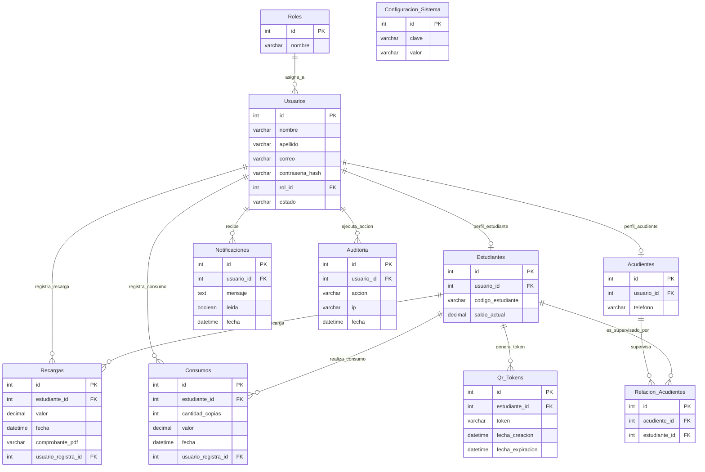

# DOCUMENTO TÉCNICO DE DESARROLLO E IMPLEMENTACIÓN V1.0
## Sistema de Monedero Digital y Gestión de Fotocopias - Instituto Universitario de Caldas (IUC)

---

## 1. INTRODUCCIÓN Y ARQUITECTURA DEL SISTEMA

Este documento consolida la documentación técnica completa del software desarrollado para el **Instituto Universitario de Caldas**. El sistema implementa un monedero digital seguro, dinámico y auditable para el control del consumo de fotocopias por los estudiantes.

### Arquitectura Tecnológica
El proyecto se diseñó bajo una arquitectura de **Monolito Modular** estructurada para ser desplegada de forma ágil sobre entornos institucionales (XAMPP / Node.js):

* **Frontend**: HTML5, CSS3 personalizado ([style.css](file:///e:/programacion/fotocopias/frontend/css/style.css)), JavaScript ES6 para la reactividad de la UI, y TailwindCSS para estructura responsiva.
* **Backend**: Node.js v16+ utilizando el framework web Express.js.
* **ORM (Mapeo Objeto-Relacional)**: Sequelize v6 para la abstracción y transaccionalidad de consultas SQL.
* **Base de Datos**: MySQL 8 (dentro de la suite XAMPP).
* **Seguridad y Tokenización**: JSON Web Tokens (JWT) para autorizaciones de sesión, Bcryptjs para encriptación de credenciales, y Helmet para seguridad de cabeceras HTTP.
* **Generación de Reportes**: PDFKit para la exportación de comprobantes individuales y reportes PDF; ExcelJS para la exportación de hojas de cálculo estructuradas.

---

## 2. ESTRUCTURA DEL DIRECTORIO DEL PROYECTO

El árbol de archivos se distribuye de la siguiente manera:

```
/e:/programacion/fotocopias/
├── /backend
│   ├── /config
│   │   └── database.js          # Inicialización y pool de conexión MySQL
│   ├── /controllers
│   │   ├── adminController.js   # CRUD de usuarios, auditoría, config
│   │   ├── authController.js    # Login, logout y forgot-password
│   │   ├── consumeController.js # Lógica de cobro y validación QR
│   │   ├── guardianController.js# Rutas de acudientes y saldos de hijos
│   │   ├── notificationController.js # Obtención y lectura de alertas
│   │   ├── rechargeController.js# Creación de recargas y abonos
│   │   └── reportController.js  # Exportador de PDF y Excel
│   ├── /middleware
│   │   ├── authMiddleware.js    # Guardia JWT y restricciones de rol
│   │   └── validationMiddleware.js # Validador de payloads express-validator
│   ├── /models
│   │   ├── index.js             # Declaración centralizada de asociaciones
│   │   ├── audit.js             # Tabla Auditoria
│   │   ├── consume.js           # Tabla Consumos
│   │   ├── guardian.js          # Tabla Acudientes
│   │   ├── guardianStudent.js   # Tabla Relacion_Acudientes
│   │   ├── notification.js      # Tabla Notificaciones
│   │   ├── qrToken.js           # Tabla Qr_Tokens
│   │   ├── recharge.js          # Tabla Recargas
│   │   ├── role.js              # Tabla Roles
│   │   ├── student.js           # Tabla Estudiantes
│   │   ├── systemConfig.js      # Tabla Configuracion_Sistema
│   │   └── user.js              # Tabla Usuarios
│   ├── /routes                  # Enrutamiento de APIs REST
│   ├── /services
│   │   ├── auditService.js      # Logger para bitácora de base de datos
│   │   ├── excelService.js      # Constructor de reportes .xlsx
│   │   ├── notificationService.js# Monitor de saldo bajo (< 5 copias)
│   │   ├── pdfService.js        # Generador de recibos y reportes .pdf
│   │   └── qrService.js         # Constructor y validador de QR
│   ├── /uploads/comprobantes    # Almacenamiento de archivos PDF
│   ├── /utils
│   │   └── logger.js            # Logging en archivos mediante Winston
│   ├── .env                     # Variables de entorno
│   └── server.js                # Servidor Express raíz
├── /database
│   ├── schema.sql               # Código DDL de la base de datos
│   └── seeds.sql                # Semillas de roles, config y cuentas
├── /docs
│   ├── api_spec.md              # Especificación REST API
│   └── documento_tecnico.md     # Este documento de arquitectura
├── /frontend                    # Interfaz web estática
│   ├── /css
│   │   └── style.css            # Estilos CSS institucionales
│   ├── /js
│   │   ├── api.js               # Cliente Fetch global y Toast UI
│   │   └── auth.js              # Gestor de sesión y redirección
│   └── /pages                   # Pantallas por rol
│       ├── login.html
│       ├── estudiante.html
│       ├── acudiente.html
│       ├── operador.html
│       ├── administrativo.html
│       └── rector.html
├── package.json                 # Scripts del proyecto
└── README.md                    # Instrucciones de uso e instalación
```

---

## 3. DIAGRAMA ENTIDAD-RELACIÓN (MER)

El siguiente diagrama detalla la estructura lógica de los datos y cómo interactúan las entidades:



---

## 4. DISEÑO DE TABLAS RELACIONALES (ESQUEMA FÍSICO)

A continuación se detalla la definición exacta de las columnas, tipos y constraints:

### 1. Tabla: `Roles`
* **id**: `INT AUTO_INCREMENT` (PK)
* **nombre**: `VARCHAR(50) NOT NULL UNIQUE` (Valores: 'Estudiante', 'Acudiente', 'Operador', 'Administrativo', 'Rector')

### 2. Tabla: `Usuarios`
* **id**: `INT AUTO_INCREMENT` (PK)
* **nombre**: `VARCHAR(100) NOT NULL`
* **apellido**: `VARCHAR(100) NOT NULL`
* **correo**: `VARCHAR(150) NOT NULL UNIQUE` (Restricción de correo institucional único)
* **contrasena_hash**: `VARCHAR(255) NOT NULL` (Hash encriptado mediante Bcrypt)
* **rol_id**: `INT NOT NULL` (FK -> `Roles.id`, ON DELETE RESTRICT)
* **estado**: `VARCHAR(20) DEFAULT 'activo'` ('activo', 'inactivo')

### 3. Tabla: `Estudiantes`
* **id**: `INT AUTO_INCREMENT` (PK)
* **usuario_id**: `INT NOT NULL UNIQUE` (FK -> `Usuarios.id`, ON DELETE CASCADE)
* **codigo_estudiante**: `VARCHAR(50) NOT NULL UNIQUE` (Código único para consulta administrativa)
* **saldo_actual**: `DECIMAL(10, 2) NOT NULL DEFAULT 0.00`

### 4. Tabla: `Acudientes`
* **id**: `INT AUTO_INCREMENT` (PK)
* **usuario_id**: `INT NOT NULL UNIQUE` (FK -> `Usuarios.id`, ON DELETE CASCADE)
* **telefono**: `VARCHAR(20) NOT NULL`

### 5. Tabla: `Relacion_Acudientes`
* **id**: `INT AUTO_INCREMENT` (PK)
* **acudiente_id**: `INT NOT NULL` (FK -> `Acudientes.id`, ON DELETE CASCADE)
* **estudiante_id**: `INT NOT NULL` (FK -> `Estudiantes.id`, ON DELETE CASCADE)
* *Unique Key*: `(acudiente_id, estudiante_id)` para evitar registros duplicados.

### 6. Tabla: `Recargas`
* **id**: `INT AUTO_INCREMENT` (PK)
* **estudiante_id**: `INT NOT NULL` (FK -> `Estudiantes.id`, ON DELETE RESTRICT)
* **valor**: `DECIMAL(10, 2) NOT NULL` (Monto recargado en pesos COP)
* **fecha**: `DATETIME DEFAULT CURRENT_TIMESTAMP`
* **comprobante_pdf**: `VARCHAR(255) NULL` (Ruta al archivo PDF físico autogenerado)
* **usuario_registra_id**: `INT NOT NULL` (FK -> `Usuarios.id`, ON DELETE RESTRICT)

### 7. Tabla: `Consumos`
* **id**: `INT AUTO_INCREMENT` (PK)
* **estudiante_id**: `INT NOT NULL` (FK -> `Estudiantes.id`, ON DELETE RESTRICT)
* **cantidad_copias**: `INT NOT NULL`
* **valor**: `DECIMAL(10, 2) NOT NULL` (Costo total calculado: copias * precio_copia)
* **fecha**: `DATETIME DEFAULT CURRENT_TIMESTAMP`
* **usuario_registra_id**: `INT NOT NULL` (FK -> `Usuarios.id`, ON DELETE RESTRICT)

### 8. Tabla: `Qr_Tokens`
* **id**: `INT AUTO_INCREMENT` (PK)
* **estudiante_id**: `INT NOT NULL` (FK -> `Estudiantes.id`, ON DELETE CASCADE)
* **token**: `VARCHAR(255) NOT NULL UNIQUE` (Token UUID v4 único generado)
* **fecha_creacion**: `DATETIME DEFAULT CURRENT_TIMESTAMP`
* **fecha_expiracion**: `DATETIME NOT NULL` (Expiración estricta de 60 segundos)

### 9. Tabla: `Notificaciones`
* **id**: `INT AUTO_INCREMENT` (PK)
* **usuario_id**: `INT NOT NULL` (FK -> `Usuarios.id`, ON DELETE CASCADE)
* **mensaje**: `TEXT NOT NULL`
* **leida**: `TINYINT(1) DEFAULT 0` (Leída: 1, No leída: 0)
* **fecha**: `DATETIME DEFAULT CURRENT_TIMESTAMP`

### 10. Tabla: `Auditoria`
* **id**: `INT AUTO_INCREMENT` (PK)
* **usuario_id**: `INT NOT NULL` (FK -> `Usuarios.id`, ON DELETE CASCADE)
* **accion**: `VARCHAR(255) NOT NULL` (Texto descriptivo del evento)
* **ip**: `VARCHAR(45) NOT NULL` (Dirección IP de origen)
* **fecha**: `DATETIME DEFAULT CURRENT_TIMESTAMP`

### 11. Tabla: `Configuracion_Sistema`
* **id**: `INT AUTO_INCREMENT` (PK)
* **clave**: `VARCHAR(50) NOT NULL UNIQUE` (ej: `precio_copia`, `modo_emergencia`, `credito_emergencia`)
* **valor**: `VARCHAR(255) NOT NULL`

---

## 5. REGLAS DE NEGOCIO IMPLEMENTADAS EN CÓDIGO

El software incorpora de forma rigurosa las siguientes reglas comerciales e institucionales:

1. **Saldo No Negativo**: En condiciones regulares, ningún consumo puede procesarse si el saldo resultante del estudiante es menor a $0.00 COP.
2. **Modo Emergencia**: Activado exclusivamente por Rectoría. Habilita una extensión de saldo negativo de crédito temporal (ej: hasta -$1500) para permitir fotocopiar material de estudio crítico ante falta de fondos.
3. **QR de Un Solo Uso**: Para impedir fraudes de clonación de QR, una vez que el token es leído y validado por el operador de la fotocopiadora, se elimina inmediatamente de la base de datos (`Qr_Tokens`).
4. **Comprobante Legal de Recarga**: Cada recarga realizada por un administrativo genera de manera síncrona e irrevocable un documento PDF descargable que sirve de soporte legal de la transacción de efectivo.
5. **No Eliminación de Historial**: El sistema no permite borrar filas en las tablas `Recargas` y `Consumos`. Si un usuario estudiante es eliminado, pero posee historial transaccional, el backend rechaza la consulta física de eliminación y, en su lugar, actualiza el estado del usuario a `inactivo` para preservar la auditoría fiscal.
6. **Umbral de Alerta Automático**: Al procesarse un consumo, el sistema calcula de forma dinámica en base al precio actual de la fotocopia si el balance del alumno es inferior a 5 copias. De ser así, se crea una alerta persistente visible para el Estudiante y su Acudiente asociado en sus respectivos paneles.

---

## 6. MAPA DE ENDPOINTS API REST (RESUMIDO)

| Módulo | Método | Endpoint | Acceso (Roles) | Función |
| :--- | :--- | :--- | :--- | :--- |
| **Auth** | `POST` | `/api/auth/login` | Público | Autenticación y obtención de JWT. |
| **Auth** | `POST` | `/api/auth/logout` | Protegido | Cierra sesión y registra auditoría. |
| **Estudiantes** | `GET` | `/api/estudiantes/perfil`| Estudiante (1) | Obtiene datos de perfil y saldo. |
| **Estudiantes** | `GET` | `/api/estudiantes/qr` | Estudiante (1) | Crea y retorna QR con token UUID. |
| **Estudiantes** | `GET` | `/api/estudiantes/movimientos`| Estudiante, Acudiente, Admin, Rector | Obtiene historial cronológico. |
| **Recargas** | `POST` | `/api/recargas` | Administrativo (4) | Registra recarga y genera PDF. |
| **Recargas** | `GET` | `/api/recargas` | Administrativo, Rector | Lista recargas registradas. |
| **Consumos** | `POST` | `/api/consumos` | Operador (3) | Valida QR/manual y descuenta saldo. |
| **Admin** | `GET/POST`| `/api/admin/usuarios` | Administrativo, Rector | CRUD completo de cuentas. |
| **Admin** | `GET` | `/api/admin/auditoria`| Administrativo, Rector | Retorna bitácora de eventos. |
| **Admin** | `PUT` | `/api/admin/config` | Rector (5) | Modifica variables del sistema. |
| **Acudiente** | `GET` | `/api/acudiente/estudiantes`| Acudiente (2) | Retorna saldos de hijos vinculados. |
| **Reportes** | `GET` | `/api/reportes/consumos`| Administrativo, Rector | Descarga consolidado (PDF/Excel). |

*Nota: La documentación de endpoints detallada con ejemplos de payloads se encuentra en [api_spec.md](file:///e:/programacion/fotocopias/docs/api_spec.md).*

---

## 7. MANUAL DETALLADO DE DESPLIEGUE EN ENTORNO XAMPP

Este apartado describe de forma minuciosa y profesional el procedimiento para realizar la instalación, configuración e integración de la plataforma completa utilizando **XAMPP** para la base de datos MySQL y el servicio web del frontend, junto con **Node.js** para la lógica del backend.

### 7.1. Requisitos Previos del Sistema
Antes de comenzar, asegúrese de tener instalados los siguientes componentes en el equipo servidor o de desarrollo:
1. **XAMPP v8.0** o superior (que incluya los módulos Apache y MySQL/MariaDB).
2. **Node.js v16.x** o superior junto con el gestor de paquetes **npm**.
3. **Navegador web moderno** (Google Chrome, Mozilla Firefox, Microsoft Edge) con soporte para JavaScript ES6.

---

### 7.2. Paso 1: Inicialización de Servicios en XAMPP
1. Abra el panel de control de **XAMPP Control Panel** desde el menú de inicio de Windows.
2. Inicie el módulo **Apache** haciendo clic en el botón `Start` (puerto por defecto: `80` / `443`).
3. Inicie el módulo **MySQL** haciendo clic en el botón `Start` (puerto por defecto: `3306`).
4. Verifique que ambos módulos se muestren con fondo verde en el panel de control, lo que confirma su correcta ejecución.

---

### 7.3. Paso 2: Creación y Estructuración de la Base de Datos
1. Abra su navegador e ingrese a la consola de administración de base de datos **phpMyAdmin**: [http://localhost/phpmyadmin/](http://localhost/phpmyadmin/).
2. En la barra lateral izquierda, haga clic en **Nuevo** (o *New*) para crear una base de datos nueva.
3. Configure los siguientes parámetros:
   - **Nombre de la base de datos:** `fotocopias_iuc`
   - **Cotejamiento (Collation):** `utf8mb4_spanish_ci` (esta configuración asegura soporte completo para caracteres del idioma español como acentos y la letra ñ).
   - Presione el botón **Crear**.
4. **Importación del Esquema DDL:**
   - Seleccione la base de datos recién creada `fotocopias_iuc`.
   - Diríjase a la pestaña **Importar** (en el menú superior).
   - Haga clic en *Seleccionar archivo* y busque la ruta física: `e:\programacion\fotocopias\database\schema.sql`.
   - Deje las opciones de importación por defecto y presione el botón **Importar** (o *Go*) al final de la página.
5. **Carga de Semillas y Datos de Prueba:**
   - Una vez cargado el esquema, vuelva a la pestaña **Importar**.
   - Seleccione el archivo físico: `e:\programacion\fotocopias\database\seeds.sql`.
   - Presione nuevamente **Importar**. Esto cargará los roles del sistema, la configuración básica y las cuentas de prueba iniciales.

---

### 7.4. Paso 3: Configuración del Entorno del Backend
El backend requiere conectarse a MySQL a través de credenciales locales. En una instalación típica de XAMPP en Windows, el usuario administrativo es `root` sin contraseña.

1. Navegue al directorio del backend: `e:\programacion\fotocopias\backend\`.
2. Cree o abra el archivo `.env` en un editor de texto. Si no existe, copie el contenido de `.env.example` o estructúrelo de la siguiente manera:
   ```env
   # Puerto en el que escuchará el backend Express
   PORT=3000
   NODE_ENV=development

   # Credenciales de conexión para base de datos XAMPP
   DB_HOST=127.0.0.1
   DB_PORT=3306
   DB_USER=root
   DB_PASSWORD=
   DB_NAME=fotocopias_iuc

   # Seguridad JWT y Encriptación
   JWT_SECRET=iuc_monedero_digital_ultra_secret_key_2026
   JWT_EXPIRES_IN=24h

   # Configuración de Seguridad adicional
   CORS_ORIGIN=http://localhost
   ```
3. Guarde los cambios del archivo `.env`.

---

### 7.5. Paso 4: Instalación de Dependencias e Inicio de la API
1. Abra una terminal de comandos (cmd o PowerShell) y acceda al directorio del backend:
   ```powershell
   cd e:\programacion\fotocopias\backend
   ```
2. Instale todas las dependencias del servidor declaradas en `package.json` utilizando npm:
   ```bash
   npm install
   ```
3. Inicie el servidor de aplicaciones Express:
   - **Modo Desarrollo (con auto-recarga mediante nodemon):**
     ```bash
     npm run dev
     ```
   - **Modo Producción o Ejecución Regular:**
     ```bash
     npm start
     ```
4. Verifique que la terminal despliegue el mensaje indicando que el servidor está escuchando en el puerto `3000` y que la conexión con el motor de base de datos MySQL mediante Sequelize fue exitosa.

---

### 7.6. Paso 5: Publicación e Integración del Frontend en XAMPP
Para aprovechar el servidor web Apache incluido en XAMPP y servir el frontend de manera optimizada:

1. Localice la carpeta del frontend en su equipo: `e:\programacion\fotocopias\frontend\`.
2. Copie la carpeta completa `frontend` o su contenido.
3. Diríjase a la ruta de instalación de XAMPP (por defecto: `C:\xampp\htdocs\`).
4. Cree una nueva carpeta llamada `fotocopias` dentro de `htdocs`.
5. Pegue los archivos y carpetas del frontend (los subdirectorios `/css`, `/js`, `/pages` y el index) directamente en `C:\xampp\htdocs\fotocopias\`.
6. **Configuración de la URL del Backend (CORS):**
   - Asegúrese de que el archivo `C:\xampp\htdocs\fotocopias\js\api.js` (u homólogo cliente) tenga definida la constante de origen del backend apuntando al puerto de Node.js:
     ```javascript
     const API_BASE_URL = 'http://localhost:3000/api';
     ```
   - Con esto, todas las vistas cargadas desde el servidor de XAMPP (`http://localhost/fotocopias/pages/...`) realizarán peticiones asíncronas correctas hacia la API de Node.js (`http://localhost:3000`).

---

### 7.7. Paso 6: Verificación de Roles y Acceso al Sistema
Abra su navegador de preferencia y acceda a la interfaz gráfica del sistema mediante la URL:
👉 **[http://localhost/fotocopias/pages/login.html](http://localhost/fotocopias/pages/login.html)**

Inicie sesión con cualquiera de los perfiles de prueba sembrados en la base de datos (contraseña general `123456`):
- **Rector (Panel de Control y Modo Emergencia):** `rector@iuc.edu.co`
- **Administrativo (Gestión de usuarios y Recargas):** `admin@iuc.edu.co`
- **Operador (Escáner de QR y Consumos):** `operador@iuc.edu.co`
- **Estudiante (Generación de QR y Balance):** `estudiante@iuc.edu.co`
- **Acudiente (Monitoreo de hijos):** `acudiente@iuc.edu.co`

*Nota: Ante cualquier error de red en consola, verifique que no existan bloqueos de cortafuegos (firewall) locales en el puerto 3000 y que la política de CORS esté permitida.*

